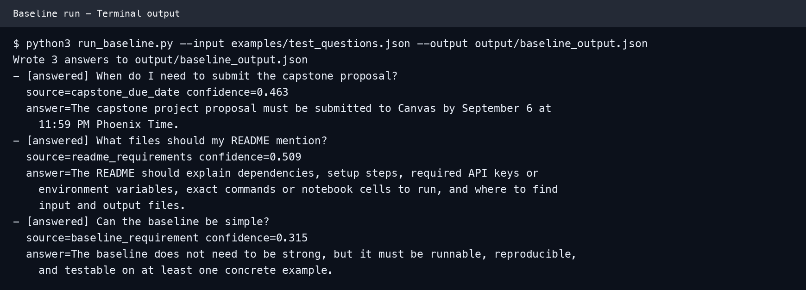

# Agentic Course Policy Q&A and Reproducibility Checklist Assistant

This repository contains a minimal runnable baseline for a capstone project proposal. The proposed system is an agentic assistant that answers student questions about assignment requirements by retrieving the most relevant course-policy entry from a small knowledge base.

## Project Idea

Students often miss details such as due dates, README requirements, repository accessibility, and baseline-output expectations. The capstone project will build an assistant that can answer assignment-policy questions and, in a later version, inspect a student's repository/notebook checklist for missing reproducibility items.

## Baseline

The baseline is a dependency-free Python retrieval system:

1. Load a small JSON knowledge base from `examples/course_faq.json`.
2. Tokenize each policy entry and remove common stop words.
3. Compute TF-IDF style vectors using only the Python standard library.
4. Compare each user question to the knowledge base with cosine similarity.
5. Return the best matching answer, confidence score, and source id.

This baseline is intentionally simple. It provides a reproducible starting point for comparing future improvements such as larger document ingestion, tool use, repository checks, or LLM-based answer generation.

## Requirements and Setup

- Python 3.10 or newer
- No third-party packages
- No API keys or environment variables

Download or clone this repository, open a terminal in its root directory, and
verify Python is available:

```bash
python3 --version
```

No package installation or configuration step is required.

## Run Instructions

From the project folder, run:

```bash
python3 run_baseline.py --input examples/test_questions.json --output output/baseline_output.json
```

The input questions are in:

```text
examples/test_questions.json
```

The baseline writes its output to:

```text
output/baseline_output.json
```

The input file is a JSON list of question strings. The output is a JSON list
containing each question, its status, confidence score, matched source id, and
answer. To use a different knowledge base, pass `--kb path/to/file.json`.

## Test Case

Sample input:

```json
[
  "When do I need to submit the capstone proposal?",
  "What files should my README mention?",
  "Can the baseline be simple?"
]
```

Actual command:

```bash
python3 run_baseline.py --input examples/test_questions.json --output output/baseline_output.json
```

Expected matched sources, in order, are `capstone_due_date`,
`readme_requirements`, and `baseline_requirement`. The committed actual output
is saved in `output/baseline_output.json`.

Run the automated checks with:

```bash
python3 -m unittest discover -s tests -v
```

The tests verify all three expected matches and the low-confidence fallback.
A screenshot of a successful baseline run is included below and at
`screenshots/baseline_run.png`.



## Known Limitations

- The knowledge base is tiny and manually written.
- The baseline retrieves a fixed answer instead of synthesizing a response.
- Similarity matching can fail when the user asks with unfamiliar wording.
- The system does not yet inspect a real repository or notebook.

## Future Evaluation Plan

The improved system will be evaluated on a held-out labeled set of at least 30
policy questions and 10 repository fixtures with known missing README items.
Policy-answer accuracy, checklist precision/recall, unsupported-answer rate,
and median latency will be compared with this baseline. The demonstration
questions in `examples/test_questions.json` will not be used as the held-out
evaluation set.
